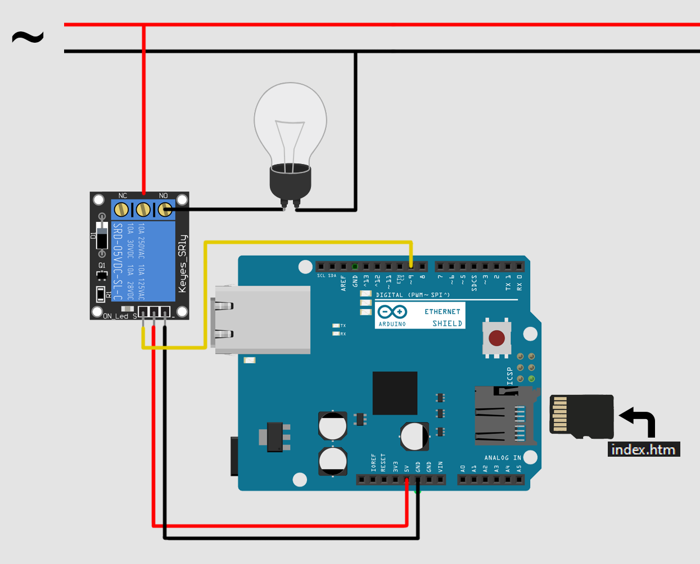

Exemplo simples para estudar o uso de Web Server através de uma Ethernet Shield em um Arduino UNO.  
Trabalho ainda em progresso.

 
Circuito utilizado

 
Exemplo da aplicação

Inspirado no Tutorial disponível em https://startingelectronics.org/tutorials/arduino/ethernet-shield-web-server-tutorial/